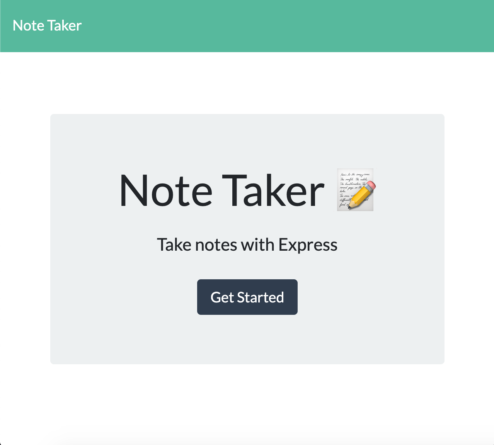
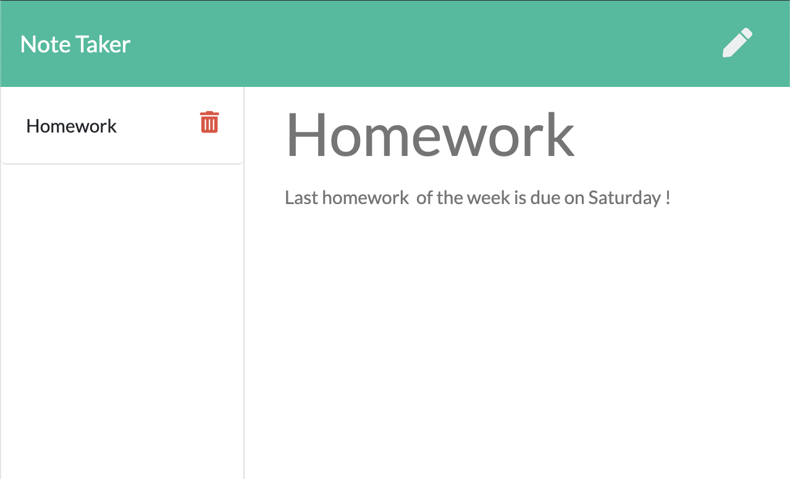
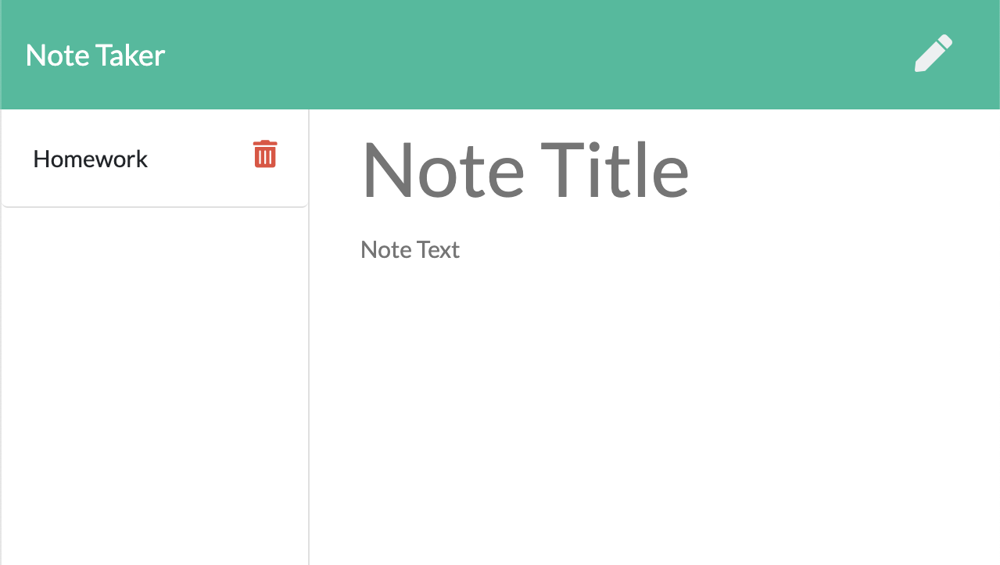

# Note Taker

## Description

This is an application designed to get a note from the user and save it to his notes list. The user can view any note by clicking on it and he can delete a specific note by clicking on the delete button next to it.

## Technologies

This app is built with `Javascript`,`Node.js` and `Express.js` on the backend and `JQuery`, `HTML` and `CSS` on the frontend. The app is being deployed on Heroku.

## Links

Application Link: https://note-take-ahmed-2020.herokuapp.com/notes

Github Repo: https://github.com/ahtiap/note-taker

## Screenshots

